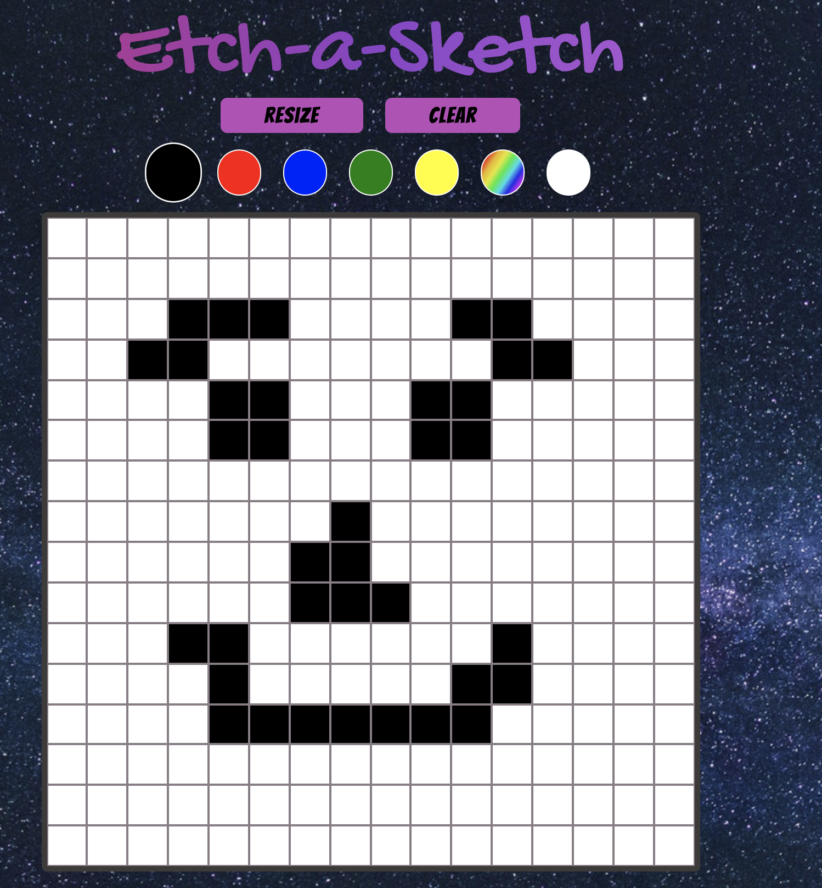

# Etch a Sketch

This is a fun Etch-a-Sketch project where you can draw to your hearts content.

> **Home page**

# 

## Table of contents

1. [Demo](#demo)
2. [Technologies](#technologies)
3. [Features](#features)

## Demo

Here is the working live demo:
[https://justinkar.github.io/Etch-a-Sketch/](https://justinkar.github.io/Etch-a-Sketch/).

## Technologies

- Javascript (ES6)

## Features

- ReSize the Grid up to 100x100 squares
- Multi-color Paint brushes
- Clear Grid
